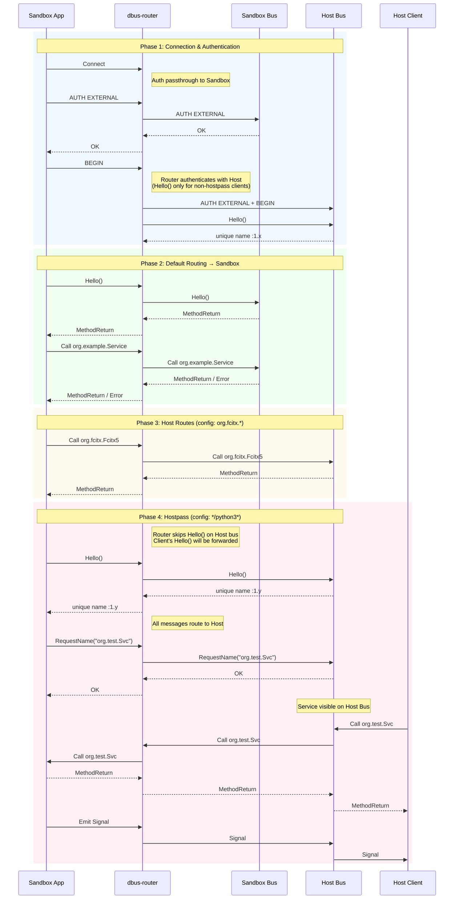

# dbus-router

A dual-upstream D-Bus router library for sandboxed applications.

## Overview

`dbus-router` sits between sandboxed applications and D-Bus, routing messages to either a host bus or a sandbox bus based on configurable rules. This enables fine-grained control over which D-Bus services a sandboxed app can access on the host system.

## Architecture

```
┌─────────────────┐     ┌─────────────────┐     ┌─────────────────┐
│  Sandbox App    │     │   dbus-router   │     │    Host Bus     │
│  (e.g. VSCode)  │────▶│                 │────▶│  (system/user)  │
└─────────────────┘     │   ┌─────────┐   │     └─────────────────┘
                        │   │ Routing │   │
                        │   │  Rules  │   │     ┌─────────────────┐
                        │   └─────────┘   │────▶│   Sandbox Bus   │
                        └─────────────────┘     │   (isolated)    │
                                                └─────────────────┘
```

## Sequence Diagram



## Configuration

Create a TOML configuration file:

```toml
# Routes specific destinations to host bus
[[host_routes]]
destination = "org.freedesktop.portal.*"

[[host_routes]]
destination = "org.fcitx.*"

# Allow specific processes to register services on host bus
[[hostpass]]
process = "*/python3*"

[[hostpass]]
process = "/usr/bin/my-service"
```

## Usage

### As a Library

```rust
use dbus_router::{Config, Router};
use std::path::PathBuf;

#[tokio::main]
async fn main() -> anyhow::Result<()> {
    let config = Config::load(&PathBuf::from("router.toml"))?;

    let router = Router::new(
        PathBuf::from("/run/user/1000/bus"),      // listen socket
        "unix:path=/run/user/1000/host".into(),   // host bus
        "unix:path=/run/user/1000/sandbox".into(), // sandbox bus
        config,
    );

    router.run().await
}
```

### As a Binary

```bash
dbus-router \
    --listen /run/user/1000/bus \
    --host "unix:path=/run/user/1000/host" \
    --sandbox "unix:path=/run/user/1000/sandbox" \
    --config router.toml
```

## Message Type Coverage

| Message Type   | Sandbox Routing | Host Routing | Hostpass |
|----------------|-----------------|--------------|----------|
| METHOD_CALL    | ✅              | ✅           | ✅       |
| METHOD_RETURN  | ✅              | ✅           | ✅       |
| ERROR          | ✅              | ✅           | ✅       |
| SIGNAL         | ✅              | ✅           | ✅       |

## License

MIT
